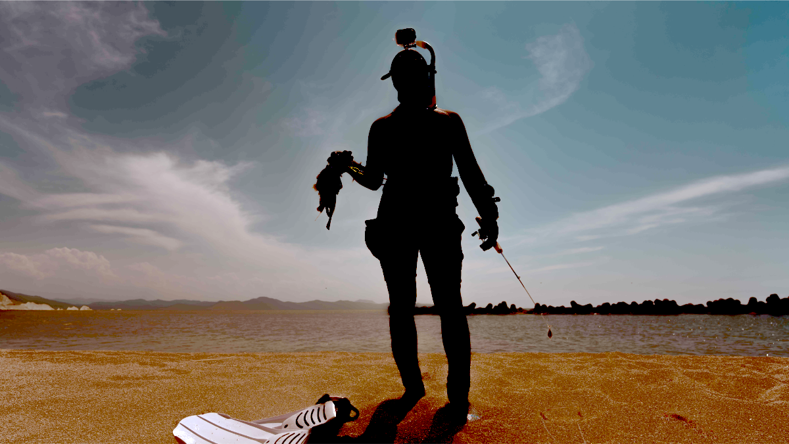
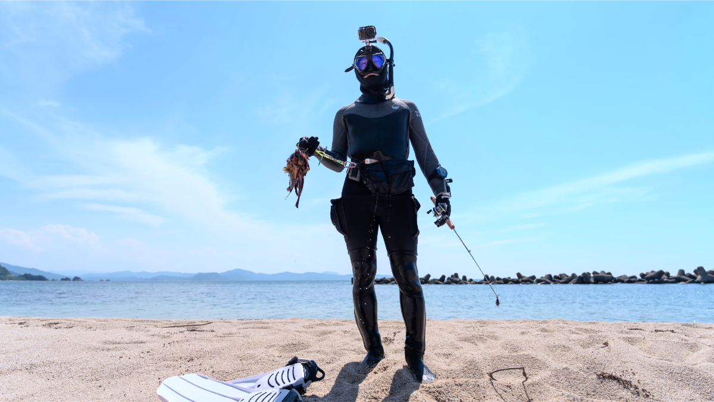
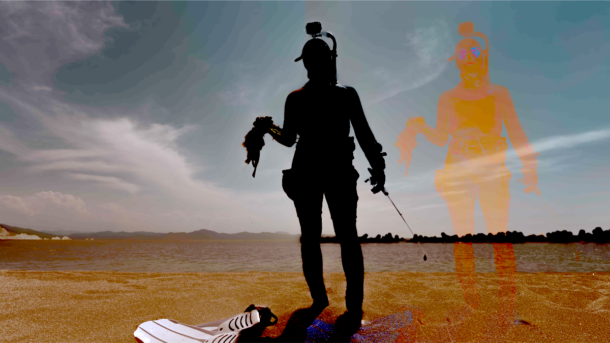
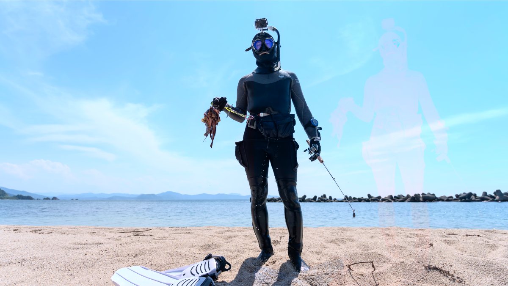
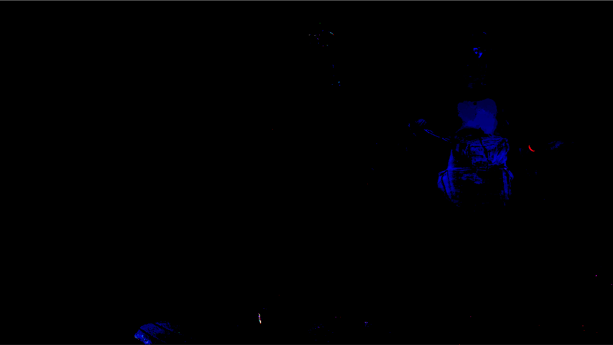
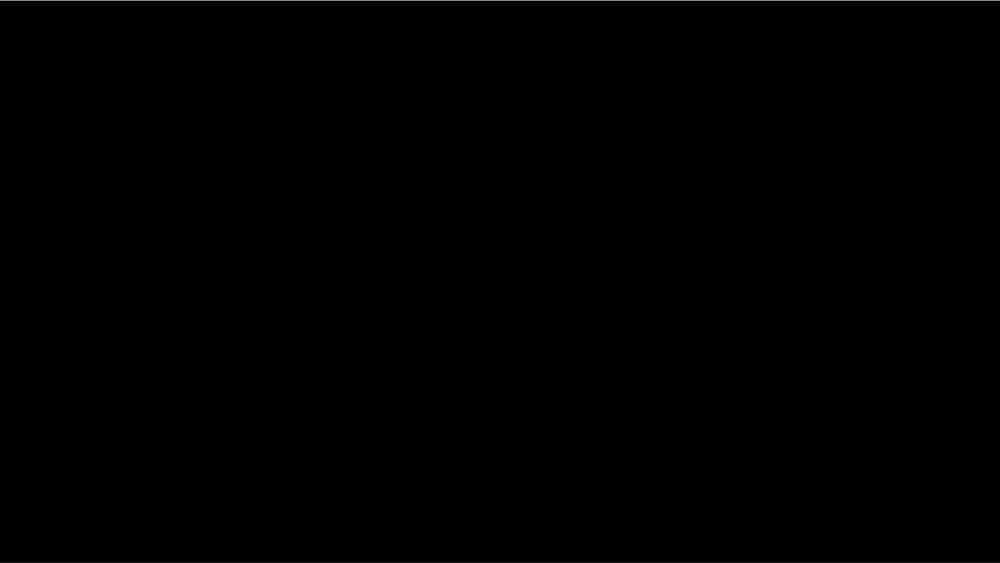
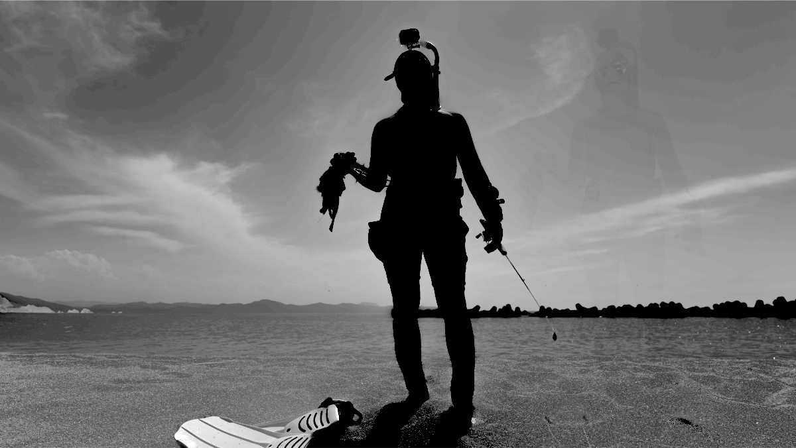

# 変換後 HEIC に出るゴースト（残像）の原因調査

## 症状

ゲインマップ付き JPEG を GainForge で HEIC に変換すると、HDR 表示時に被写体（人物）の**半透明のゴースト（残像）が横方向にずれて重なって見える**。

- 例: `A1_07172.jpg`（Sony A1、8444×4754）を変換した HEIC を HDR 表示すると、人物の右側に薄い人物のシルエットが浮かぶ。
- 入力 JPEG を HDR 表示してもゴーストは出ない。**写真アプリで書き出した HEIC でも出ない。GainForge 出力にだけ出る。**

## 結論（先に要点）

1. **これは GainForge のバグである。** Apple「写真」アプリで同じ JPEG を書き出した HEIC（`~/Downloads/A1_07172.heic`）は**ゴーストが無くクリーン**。同じ入力から写真アプリは正常な出力を作れているのに、GainForge 出力にはゴーストが出る。
2. **発生箇所は GainForge の `writeGainMapHEIC` のゲインマップ処理経路**（ゲインマップを `DisplayP3 PQ` で BGRA8 に焼いて補助辞書へ渡し、ImageIO に HEIC 再エンコードさせる部分）と考えられる。ベース SDR・ゲインマップ寸法・色空間は写真アプリ出力と一致しているため、ゴーストはこの「ゲインマップの焼き込み／格納」の工程で混入している。
3. **正確な機序（単一の根本原因）はまだ未特定。** 当初「クロマ（色）だけが原因で彩度ゼロ化で消える」と考えたが誤りで、彩度ゼロ化では消えない。次節の検証で切り分けた範囲を残す。

> **訂正履歴（重要）**
> - 初版: 「ゴーストはクロマのみに起因し、ゲインマップのモノクロ化で消える」→ 彩度ゼロ化で消えないことを確認し撤回。
> - 第2版: 「写真アプリ出力も同じゴーストを出すので GainForge のバグではない」→ **参照ファイルの取り違えによる誤り**。当時参照していた `~/Downloads/Photos-3-001/A1_07172.heic`（2.6MB）は写真アプリ出力ではなく、ゴーストを持っていた（旧 GainForge 出力と思われる）。**本物の写真アプリ出力**は `~/Downloads/A1_07172.heic`（4.06MB）で、これはクリーン。したがって結論は「**GainForge のバグ**」に訂正。

## 検証

入力 JPEG・GainForge 出力・**本物の写真アプリ書き出し**の 3 つを直接ダンプ・差分して比較した。

### 1. メタデータは 3 者で一致（寸法ずれではない）

| ファイル | ベース | ゲインマップ寸法 | PixelFormat | 色空間 |
|---|---|---|---|---|
| 入力 `A1_07172.jpg` | 8444×4754 | 8444×4754 (BytesPerRow 8448) | `'444f'`（YCbCr 4:4:4） | DisplayP3 PQ |
| GainForge 出力 `.heic` | 8444×4754 | 8444×4754 (BytesPerRow 8448) | `'420f'`（YCbCr 4:2:0） | DisplayP3 PQ |
| **写真アプリ `~/Downloads/A1_07172.heic`** | 8444×4754 | 8444×4754 (BytesPerRow 8448) | `'420f'`（YCbCr 4:2:0） | DisplayP3 PQ |

メタデータ上は GainForge と写真アプリは同一（寸法・色空間・PixelFormat）。**それでも実際の画素は異なり、GainForge にだけゴーストが出る。**

### 2. 本物の写真アプリ出力はクリーン（基準・正解）

写真アプリ出力のゲインマップ（コントラスト強調）と合成 HDR。ゴーストは無い。これが「あるべき出力」。

| | |
|---|---|
|  ゲインマップ：単一シルエット |  合成 HDR：ゴーストなし |

### 3. GainForge 出力にはゴーストが出る

GainForge 出力のゲインマップ（コントラスト強調）には、人物右側に余分なシルエット（色付き）が現れる。合成 HDR にもゴーストが出る。

| | |
|---|---|
|  ゲインマップ：右側にゴースト |  合成 HDR：ゴーストあり |

### 4. 写真アプリ出力 vs GainForge 出力の合成差分

両者の合成 HDR を差分すると、差は**ゴースト領域（右にずれた人物形）**に集中する。写真アプリには無く GainForge にだけある差。

### 5. ベース SDR・ゲインマップ輝度は入力と一致（位置ずれは無い）

- ベース SDR：入力 JPEG との差は HEVC 圧縮ノイズのみ（平均 ≈ 10/7/13）。
- ゲインマップ輝度：入力 JPEG との差はほぼ真っ黒（平均 ≈ 3/255）。
- ゲインマップ輝度とベース輝度の重ね合わせは全面一致（位置ずれ無し）。

→ ベースもゲインマップ輝度も入力と一致し位置ずれも無いのに、**合成にだけゴーストが出る**。差を生む要因は焼き込み／格納工程にある。

### 6. 彩度ゼロ化（クロマ除去）では消えない

ゲインマップを彩度ゼロ化してもゴーストは消えない。色（クロマ）の除去だけでは解決しない。

## 現時点の整理

- 確実: **写真アプリ出力はクリーン、GainForge 出力にはゴースト。GainForge のバグ。**
- 確実: ベース SDR・ゲインマップ輝度は入力と一致、位置ずれも無い。メタデータも写真アプリと一致。
- 未解明: 部品が一致するのに合成だけにゴーストが出る機序。彩度ゼロ化（クロマ除去）では消えない。
- 注目すべき差: GainForge は `CIImage(.auxiliaryHDRGainMap)` で読んだゲインマップを `DisplayP3 PQ`／`workingColorSpace=NSNull` で BGRA8 に焼いて補助辞書へ渡す。写真アプリは内部経路が異なる。焼き込み時の色空間解釈・8bit 量子化・PQ でのレンダリングなどが疑わしい。

## 修正に向けた調査候補（未実施）

- ゲインマップ焼き込み時の色空間／`workingColorSpace` 設定を見直す（PQ で焼くのが適切か、別経路があるか）。
- ImageIO に「補助辞書として 32BGRA を渡す」のではなく、写真アプリと同等になる別 API（例: `CIContext.writeHEIF…` 系や、ゲインマップ付き画像を直接書く経路）を検討。ただし CLAUDE.md にある通り `writeHEIFRepresentation(hdrImage:)` はハイライト色ずれの別問題があるため、安易な置換は不可。
- ゲインマップ本体の取得方法（`.auxiliaryHDRGainMap` で読む CIImage）と、補助辞書の `Data` を写真アプリ出力から逆解析して、どの段階でゴーストが入るかをさらに細分化する。

> 本書は調査記録。コードの修正は未適用。

## 再現に使った環境

- 入力: `~/Downloads/Photos-3-001/A1_07172.jpg`（Sony A1、ISO ゲインマップ、`'444f'`）
- **正解の参照（写真アプリ書き出し）: `~/Downloads/A1_07172.heic`（4.06MB、クリーン）**
- GainForge 出力: `swift run gainforge -y -o <dir> A1_07172.jpg`
- 注意: `~/Downloads/Photos-3-001/A1_07172.heic`（2.6MB）は写真アプリ出力ではない（ゴーストあり）。参照に使わないこと。
- 検証: 補助辞書ダンプ（PixelFormat / BytesPerRow / 色空間）、`CIImage(.auxiliaryHDRGainMap)` の PNG 化、`colorControls`（saturation / contrast）、`colorAbsoluteDifference` による各部品・合成の差分、ゲインマップ輝度とベースの重ね合わせ。
