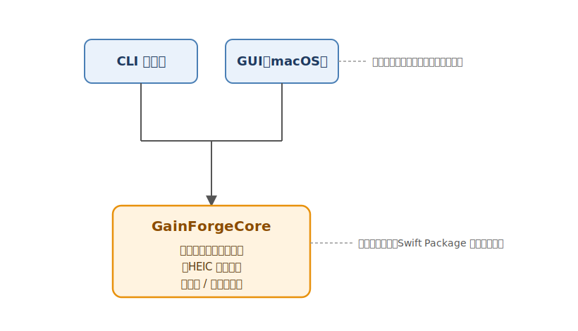

# GainForge 仕様

> 本書は GainForge の確定仕様（実装に追随）。アーキテクチャ・コアライブラリ・CLI・動作環境を定める。
> GUI の画面仕様は [画面仕様.md](画面仕様.md) を参照。

## 変更履歴

- 2026-06-26: 初版（たたき台）。アーキテクチャ方針と機能要件のドラフト。
- 2026-06-26: 実装に合わせて確定仕様へ改訂。Core API（`convert` / `ConversionResult` / `GainForgeError` ほか）・CLI オプション（`-y`）・2 ビルドシステム（SwiftPM + XcodeGen）・落とし穴 7 点・動作環境を実装準拠に更新。GUI は [画面仕様.md](画面仕様.md) として確定済み。
- 2026-07-04: **SDR→HDR 自動補正モード**を追加。ゲインマップ無し（SDR）入力を、明部加重の逆トーンマッピングで HDR ゲインマップ付き HEIC へ合成する経路（`writeExpandedHDRHEIC`）を新設。`SDRConversion` enum と `convert(sdrMode:)`、CLI `-x` / `--hdr`、GUI の「SDR画像」ポップアップ、`GainForgeError.hdrSynthesisFailed` を追加。HDR 入力（ゲインマップ付き）の生転写挙動は不変。
- 2026-07-04: **SDR→HDR 合成出力を 10bit 化**（`writeHEIF10Representation`、HEVC Main 10）。16bit PNG 等の高精度入力の階調を保ちバンディングを抑える。SDR 保存（`.sdr`）は 8bit のまま。**ML/LUT 方式 `.hdrML`** を追加（Apple 学習の色→ゲイン統計 LUT を `CIColorCube` で適用。`writeMLExpandedHDRHEIC`、CLI `-m` / `--hdr-ml`、GUI ポップアップ「HDR補正（ML/LUT）」）。同梱 LUT を読めないときは `.hdrCurve` へ自動降格し、CLI は stderr に一度・GUI は起動中一度だけ通知する（可否は `isMLGainLUTAvailable`）。
- 2026-07-08: **書き出し時リサイズ**を追加。全経路（生転写 / SDR / 合成）共通で **アスペクト比維持・縮小のみ** の縮小に対応（`ResizeMode` = `.original` / `.megapixels` / `.fitWidth` / `.fitHeight`、`ResizePlanner`、`convert(resize:)`）。再サンプルは `CILanczosScaleTransform`。生転写ではベースとゲインマップを同率で縮小。CLI `--mpix` / `-w` / `--height`、GUI ツールバーの「サイズ」ポップアップ＋数値フィールド（プリセット付き）を追加。設定の永続化・リセット対象に追加。既定はリサイズなしで既存挙動は不変。

---

## 目次

- [概要](#概要)
- [背景・技術的根拠](#背景技術的根拠)
- [アーキテクチャ](#アーキテクチャ)
  - [全体構成（3層）](#全体構成3層)
  - [リポジトリ構成と2つのビルドシステム](#リポジトリ構成と2つのビルドシステム)
- [GainForgeCore（コアライブラリ）](#gainforgecoreコアライブラリ)
- [CLI ツール](#cli-ツール)
- [GUI ツール（macOS）](#gui-ツールmacos)
- [変換ロジックの要点（移植元の実証結果）](#変換ロジックの要点移植元の実証結果)
- [動作環境](#動作環境)
- [今後の検討](#今後の検討)

---

## 概要

GainForge は、Lightroom や DJI / Sony 等が書き出した **HDR ゲインマップ付き JPEG** を、
**ゲインマップを保持したまま HEIC に変換する macOS 向けツール**。

出力は「SDR ベース画像 + ISO ゲインマップ」という、iPhone / 写真アプリと同じ HDR 構造。
SDR ディスプレイでも破綻せず、写真アプリでは元の HDR JPEG と同じ HDR 表示になる。
同等の見た目を保ちつつファイルサイズを削減できる（品質パラメータで調整可能）。

移植元は AISandbox リポジトリの `HDRHEIF/hdrheic.swift`（実証・検証済み）。
GainForge ではこれをライブラリ化し、CLI と GUI から共通利用する。

加えて、**ゲインマップを持たない通常の SDR 画像**を HDR 化する **SDR→HDR 自動補正モード**を備える。
明部（空・光源・鏡面反射）だけを HDR ヘッドルームへ拡張し、ベース画像（SDR 表示の見た目）は
維持したまま「SDR ベース + 合成ゲインマップ」の写真アプリ同型 HEIC を書き出す。方式は
`SDRConversion` で切り替え、既定は従来どおり SDR 保存。HDR 入力の生転写には一切影響しない。

## 背景・技術的根拠

- 旧来の Core Image `writeHEIFRepresentation(hdrImage:)` 方式は、元のゲインマップを捨てて
  SDR↔HDR 差分から**再計算**するため、ハイライトで色がずれる（写真アプリ書き出しとの平均差分 0.0227）。
- 解法は **ImageIO 低レベル経路で元のカラーゲインマップを Display P3 PQ のまま生転写**すること。
  写真アプリ書き出しの正解 HEIC と画素・コンテナ構造ともほぼ完全一致（平均差分 0.0067〜0.0231）。
- 詳細な調査結果は [Archive/調査_色ずれ原因と解法.md](Archive/調査_色ずれ原因と解法.md)
  および [Archive/調査_色ずれ原因と解法AISandbox.md](Archive/調査_色ずれ原因と解法AISandbox.md) を参照。

## アーキテクチャ

### 全体構成（3層）



- 変換ロジックは **GainForgeCore** に一元化し、CLI と GUI はそれを import するだけの薄い層にする。
- 新しい変換挙動は必ず `GainForgeCore` に実装し、CLI / GUI からは呼ぶだけにする
  （ロジックを 1 箇所へ集約してテスト・保守・挙動の一貫性を担保する）。

### リポジトリ構成と2つのビルドシステム

1 つのリポジトリを **2 つのビルドシステム**で管理する。

- **SwiftPM**（[Package.swift](../Package.swift)）— `GainForgeCore`（ライブラリ）と
  `gainforge`（CLI 実行ファイル）。`swift build` / `swift test` で完結する。
- **Xcode**（[App/GainForge.xcodeproj](../App/GainForge.xcodeproj)）— GUI アプリ。
  `GainForgeCore` を**ローカル Swift Package 依存**として参照する（`App/project.yml` の
  `packages.GainForge.path: ..`）。`.xcodeproj` は **XcodeGen 管理**で、`App/project.yml` が
  真実のソース。ターゲット・ビルド設定・依存・ファイル構成を変える場合は `project.yml` を
  編集して `cd App && xcodegen generate` で再生成する。

```
GainForge/
├── Package.swift               # SwiftPM マニフェスト（Core ライブラリ + CLI 実行ファイル）
├── Sources/
│   ├── GainForgeCore/          # ライブラリターゲット（変換ロジック）
│   │   ├── GainForge.swift         # 中核 API（変換・検出・SDR→HDR 合成・ユーティリティ）
│   │   ├── SDRConversion.swift     # SDR 入力の変換方式（sdr / hdrCurve / hdrML）
│   │   ├── GainForgeError.swift    # 型付きエラー（LocalizedError 準拠・日本語）
│   │   └── ConversionResult.swift  # 変換結果（サイズ・HDR 種別）
│   └── GainForgeCLI/           # 実行可能ターゲット（CLI、Core に依存。引数パースのみ）
├── App/                        # GUI（macOS / SwiftUI）。Core をローカルパッケージ参照
│   ├── project.yml                 # XcodeGen の定義（プロジェクト設定の真実のソース）
│   ├── GainForge.xcodeproj         # 生成物（直接編集しない）
│   ├── Sources/                    # SwiftUI 画面・状態管理・比較ビューワ
│   └── Tests/                      # GUI（AppViewModel ほか）のテスト
├── Tests/
│   └── GainForgeCoreTests/     # Core のユニットテスト（変換正当性の回帰）
├── Docs/
│   ├── 仕様.md                 # 本書
│   ├── 画面仕様.md             # GUI の画面仕様
│   └── Archive/               # 移植元の調査資料・旧ドキュメント
└── README.md
```

- CLI と Core は SwiftPM の `Package.swift` で完結させる。
- GUI（SwiftUI / macOS アプリ）は Xcode プロジェクトとし、`GainForgeCore` を
  **ローカル Swift Package 依存**として参照する（同一リポジトリ内のパッケージを参照）。

## GainForgeCore（コアライブラリ）

変換の中核 API を提供する。`enum GainForge` 名前空間の static メソッド群として公開する
（実装は [Sources/GainForgeCore/GainForge.swift](../Sources/GainForgeCore/GainForge.swift)）。

### 変換

```swift
@discardableResult
public static func convert(
    input: URL,
    output: URL,
    quality: Double = 0.6,
    gainScale: Double = 1.0,
    force: Bool = false,
    overwrite: Bool = false,
    sdrMode: SDRConversion = .sdr,
    resize: ResizeMode = .original
) throws -> ConversionResult
```

- ゲインマップ有りの入力は生転写方式で **HDR HEIC** に変換する（`sdrMode` の影響を受けない）。
- ゲインマップ無しの入力は、`force == true` のときのみ変換し、`false` のときは
  `GainForgeError.noGainMap` を投げる（CLI の `-f` 既定挙動に相当）。変換方式は `sdrMode`:
  - `.sdr`（既定）: 従来どおり **SDR HEIC**（8bit）として書き出す。
  - `.hdrCurve`: 明部加重の逆トーンマッピングで**ゲインマップを合成**し **10bit HDR HEIC** として書き出す。
  - `.hdrML`: Apple 学習の色→ゲイン統計 LUT でゲインマップを合成し **10bit HDR HEIC** として書き出す。同梱 LUT を読めないときは `.hdrCurve` へ自動降格し、その旨をユーザーへ通知する。
- `quality`: HEVC 品質（0.0–1.0、内部でクランプ）。SDR ベース画像の圧縮率に作用し、
  生転写のゲインマップは不変。
- `gainScale`: ゲインマップの縮小率（1.0 で原寸、<1.0 でサイズ削減・任意）。生転写経路のみ。
- `resize`: 書き出し時のリサイズ方式（既定 `.original` はリサイズなし）。全経路共通で **アスペクト比維持・縮小のみ**（原寸超え指定は原寸のまま）。`.megapixels(Double)`（総画素数）/ `.fitWidth(Int)` / `.fitHeight(Int)`。再サンプルは `CILanczosScaleTransform`（最高品質）。生転写ではベースとゲインマップを同率で縮小し、合成経路は合成前に SDR を縮小する。目標寸法は純粋ロジック `ResizePlanner` が計算し、縮小にならないときは等倍経路をそのまま通す。
- `overwrite`: 出力先に既存ファイルがある場合に上書きするか。`false` で既存があれば
  `GainForgeError.outputExists` を投げる（事前計画外の予期せぬ上書きを防ぐ安全弁）。
- `output` の親ディレクトリは呼び出し側で用意すること（無いと生成に失敗する）。
- 戻り値 `ConversionResult` は出力 URL・変換前後バイト数・HDR 種別を持つ。`isHDR` は
  「出力がゲインマップを持つか」を表し、`.hdrCurve` / `.hdrML` で合成した出力も `true`。

### SDR 入力の変換方式 `SDRConversion`

ゲインマップ**無し**入力にのみ効く方式指定（HDR 入力は常に生転写）。

| case | 挙動 |
|---|---|
| `.sdr` | SDR HEIC としてそのまま保存（従来挙動、既定） |
| `.hdrCurve` | 明部加重の逆トーンマッピングで HDR ゲインマップを合成（`writeExpandedHDRHEIC`、10bit） |
| `.hdrML` | Apple 学習の色→ゲイン統計 LUT で HDR ゲインマップを合成（`writeMLExpandedHDRHEIC`、10bit）。LUT を読めないときは `.hdrCurve` へ自動降格し通知する |

合成方式（`.hdrCurve` / `.hdrML`）は共通の 10bit 書き出し経路（`writeSynthesizedHDRHEIC`）に合流し、ゲイン合成だけを差し替える。LUT の可否は `isMLGainLUTAvailable` で公開する。さらなる将来案として ExpandNet 等の学習モデルを CoreML 化し同経路へ合流させる余地がある。

### 検出・ユーティリティ

| API | 役割 |
|---|---|
| `hasGainMap(_ url: URL) -> Bool` | 入力が ISO / HDR いずれかのゲインマップを持つか判定 |
| `collectInputImages(_ url: URL) -> [URL]` | フォルダを再帰探索し対応拡張子（`*.jpg` / `*.jpeg` / `*.png`）の URL 一覧を返す（ファイルはそのまま 1 件）。結果はパス順ソート。対応拡張子は `supportedInputExtensions` |
| `fileSize(_ url: URL) -> Int` | ファイルのバイト数（取得不能時は 0） |
| `uniqueOutputURL(directory:stem:) -> URL` | 同名 HEIC があれば連番（`_1`, `_2`, …）を付けた未使用 URL を返す（上書き回避） |

### 戻り値型 `ConversionResult`

`outputURL` / `inputBytes` / `outputBytes` / `isHDR`（HDR HEIC なら true、SDR HEIC は false）
を持つ `Sendable` な struct。`sizeRatio`（出力/入力のサイズ比 0.0–1.0、入力不明時 nil）を提供する。

### エラー型 `GainForgeError`

`Error & Sendable` かつ `LocalizedError` 準拠で、`errorDescription` に日本語メッセージを返す
（GUI でそのまま表示、CLI は `localizedDescription` を出力）。移植元は Bool 返却だったが、
型付きエラーにして CLI / GUI 双方が原因を区別できるようにした。case は以下。

| case | 意味 |
|---|---|
| `cannotReadSource(URL)` | 入力画像ソースを開けなかった |
| `noGainMap(URL)` | ゲインマップ無し入力を `force` なしで変換しようとした（スキップ相当） |
| `gainMapColorSpaceMissing` | 補助辞書から ColorSpace を取得できなかった |
| `gainMapImageUnreadable` | ゲインマップ本体をカラー画像として読めなかった |
| `gainMapEmpty` | ゲインマップのサイズが不正（幅・高さ 0 以下） |
| `baseImageUnreadable` | ベース SDR 画像を取得できなかった |
| `destinationCreateFailed(URL)` | HEIC 出力先を生成できなかった |
| `finalizeFailed(URL)` | HEIC のファイナライズに失敗した |
| `gainMapVerificationFailed(URL)` | 書き出し後の検算でゲインマップが埋め込まれていなかった（落とし穴 6） |
| `outputExists(URL)` | 上書き許可なしで出力先に既存ファイルがあった |
| `hdrSynthesisFailed(URL)` | SDR→HDR 合成に失敗した（`.hdrCurve` / `.hdrML`）。`.hdrML` は LUT 未同梱・破損の場合は失敗ではなく `.hdrCurve` へ降格する |

## CLI ツール

移植元 `hdrheic.swift` の CLI 仕様を踏襲しつつ、変換ロジックは持たず `GainForgeCore` に委譲する
（[Sources/GainForgeCLI/main.swift](../Sources/GainForgeCLI/main.swift) は引数パースと結果表示のみ）。

| オプション | 説明 |
|---|---|
| `-q <0.0-1.0>` | HEVC 品質（既定 `0.6`）。SDR ベース画像の圧縮率に作用。ゲインマップは生転写のため不変 |
| `-o <出力先>` | 出力フォルダ（省略時は入力と同じ場所に `.heic`） |
| `-f` | ゲインマップ無し画像も SDR HEIC として変換（既定は警告してスキップ） |
| `-x` / `--hdr` | ゲインマップ無し画像を HDR 自動補正（明部加重カーブ、`.hdrCurve`）して変換。指定で `-f` 相当 |
| `-m` / `--hdr-ml` | ゲインマップ無し画像を HDR 自動補正（Apple 学習の色→ゲイン LUT、`.hdrML`）して変換。指定で `-f` 相当。LUT を読めないときはカーブ法へ降格し stderr に一度通知 |
| `-y` / `--overwrite` | 既存の出力ファイルを上書き（既定はスキップ） |
| `--mpix <N>` | アスペクト維持で総画素数（百万画素）へ縮小（例 `--mpix 8`） |
| `-w` / `--width <px>` | アスペクト維持で横幅へ縮小 |
| `--height <px>` | アスペクト維持で縦幅へ縮小 |
| `-h` / `--help` | 使い方を表示して終了 |
| `<入力 ...>` | ファイル / フォルダ（フォルダは再帰的に `*.jpg` / `*.jpeg` / `*.png` を処理） |

- 各ファイルの結果（成功 / スキップ / 失敗）を 1 行ずつ表示し、末尾に件数を集計する。
  失敗が 1 件でもあれば終了コード 1 を返す。
- ゲインマップ縮小（`gainScale`）は Core API には実装済みだが、現状 CLI オプションとしては未公開。
- リサイズ（`--mpix` / `-w` / `--height`）は全経路共通で **縮小のみ・アスペクト比維持**。3 方式は最後の指定が有効。原寸超え指定は原寸のまま出力する。

## GUI ツール（macOS）

- SwiftUI ベースの macOS アプリ。`GainForgeCore` をローカルパッケージ参照する。
  変換ロジックは持たず、UI と状態管理のみを担う。
- 主軸は macOS（開発機と同一、CLI とコード共有が容易、フォルダ一括変換に向く）。
  将来 iOS へ展開する場合に備え、UI は極力プラットフォーム非依存に保つ。
- **画面仕様の詳細は [画面仕様.md](画面仕様.md) を参照**（単一ウィンドウ・ファイル一覧テーブル・
  比較ビューワ・状態遷移など）。実装上の要点は以下。
  - JPEG / フォルダのドラッグ&ドロップを一覧テーブルで受け入れ、各行を「待機」で追加。
    サムネ・サイズ・ゲインマップ有無は同時数を抑えた probe で非同期取得する。
  - バッチ変換は**スライディングウィンドウ方式の並列実行**（同時数 ≈ コア数、上限 3）。
    1 件完了ごとに該当行をライブ更新する。中止要求後は新規投入を止め、実行中の 1 件は完走させる。
  - 出力先の事前計画は純粋ロジック `OutputPlanner` に分離。バッチ内衝突は連番で必ず回避し、
    ディスク上の既存ファイルは上書き確認ダイアログで解決する。
  - 変換前後を左右で拡大比較する**比較ビューワ**（別ウィンドウ・シングルインスタンス・
    同期パン・変換後ペインの HDR/EDR 描画）を備える。
  - ツールバーに「SDR画像」ポップアップを備え、ゲインマップ無し入力を「SDRで保存」/
    「HDR補正（カーブ）」のどちらで変換するか選ぶ（既定は SDR 保存）。HDR 入力には影響しない。
  - ツールバーに「サイズ」ポップアップ＋数値フィールド（プリセット付き）を備え、書き出し時の縮小
    （元のサイズ / 総画素数 / 横幅 / 縦幅）を選ぶ。縮小のみ・アスペクト比維持。全経路に効く。
  - 設定（品質・出力先・SDR画像の扱い・リサイズ）は `UserDefaults` に永続化する。

## 変換ロジックの要点（移植元の実証結果）

`writeGainMapHEIC` に実装されている「落とし穴」。**触る前に必ず理解すること**（移植元で実証済み）。

1. ゲインマップは元の補助辞書（`kCGImageAuxiliaryDataTypeISOGainMap`）から
   **Metadata と ColorSpace を取得**する（ISO 型では実ピクセルデータは辞書に含まれず、macOS では nil）。
2. ゲインマップ本体は `CIImage(.auxiliaryHDRGainMap)` で**カラー画像として読む**。
3. 焼き込みは **元の ColorSpace（典型: Display P3 PQ）のまま** `render(format: .BGRA8)`。
   `workingColorSpace` に `NSNull()` を渡して CoreImage の色変換をパススルーにする。
   sRGB 等で焼くと二重変換で HDR が破綻する。
4. 補助辞書再構成時の `PixelFormat` は **`32BGRA`** に作り直す
   （元の非公開フォーマット流用は `Finalize` クラッシュ）。
5. ゲインマップ ColorSpace は**ハードコードせず元辞書から取得**（機種ごとに異なるため）。
6. 書き出し後に `hasGainMap` で**検算**する（補助データ追加は戻り値を返さないため）。
7. ベース画像を `CGImageDestinationAddImage` に渡す際は、**元画像のプロパティ辞書
   （`CGImageSourceCopyPropertiesAtIndex`）を必ずマージして渡す**。`CGImage` 単体はピクセルのみで
   EXIF/GPS/TIFF/Orientation を持たず、品質オプションだけ渡すと**全メタデータが失われ、
   Orientation 欠落で表示が回転し得る**。SDR フォールバック（`writeSDRHEIC`）も
   同様に ImageIO 経路でプロパティを引き継ぐ。

**生転写経路では** Core Image の `writeHEIFRepresentation(hdrImage:)` は使わない
（元ゲインマップを捨て差分から再計算してハイライトで色がずれるため）。

### SDR→HDR 合成（`writeExpandedHDRHEIC` / `.hdrCurve`）

ゲインマップを持たない SDR 画像から、明部だけを HDR ヘッドルームへ拡張した HEIC を合成する。
**生転写経路とは前提が異なる**（保存すべき元ゲインマップが無く、こちらが新規に作る）ため、
ここでは CoreImage のゲインマップ生成をあえて利用する。要点:

1. **明部加重の逆トーンマッピング**。作業空間を拡張リニア Display P3 にし、輝度から算出した
   無彩スカラーゲイン `gain = 1 + (headroom−1)·smoothstep(knee, 1, L)` を RGB へ一律に掛ける
   （色相・彩度は不変）。中間調・暗部は等倍（gain≈1）で、閾値 `knee` 以上の明部だけが伸びる。
   → 実測でも写真的題材ではゲインマップの平均値がごく低く（大半が非ブースト）、局所ハイライトのみ拡張される。
2. **ヘッドルームは自動決定**（完全自動、ユーザーのつまみ無し）。平均輝度から、暗い画像ほど強め・
   明るい画像ほど眩しさを避けて控えめに（約 1〜2 stop）。
3. **書き出しは `writeHEIF10Representation(of: SDR, options: [.hdrImage: 合成HDR])`**。SDR ベースと
   合成 HDR の差分から CoreImage が ISO ゲインマップを生成・埋め込む（写真アプリと同じ構造）。
   ベースの色は Display P3（PQ ではない）。出力は **10bit HEIC（HEVC Main 10）**——16bit PNG 等の
   高精度入力の階調を保ち、空などのバンディングを抑える（ベース CIImage は float 精度のまま渡り、
   量子化は 10bit 出力時の一度だけ）。**SDR 保存（`.sdr`）は従来どおり 8bit のまま**。
4. **ベース画像は元 SDR のまま維持**。SDR ディスプレイでの見た目は変えず、HDR 表示でのみ明部が伸びる。
5. **EXIF/GPS/TIFF/Orientation は `settingProperties` で引き継ぐ**（落とし穴 7 と同趣旨。
   欠落すると回転・メタデータ喪失）。書き出し後に `hasGainMap` で**検算**する（落とし穴 6 と同様）。
6. ゲイン計算は自前の `CIColorKernel`（stock フィルタの multiply が拡張レンジをクランプし得るため）。
   文字列カーネル API は macOS 10.14 で非推奨だが現行動作し、SwiftPM ライブラリへ Metal カーネルを
   組み込むビルド構成を避けるため v1 では意図的に採用。

## 動作環境

- **macOS 15 以降**（ISO ゲインマップ対応のため必須。`Package.swift` / `project.yml` で要求）。
- **Swift 6 / Xcode 16 以降**。追加ライブラリ不要（Apple フレームワークのみ：ImageIO / Core Image ほか）。
- Apple Silicon を主対象。
- GUI はローカルツールのため App Sandbox 無効（入力隣への `.heic` 書き出しを許可）。Hardened Runtime 有効。

## 今後の検討

- [x] **SDR→HDR の ML 方式**（`.hdrML`）を実装済み。Apple 写真ライブラリの実 HDR から集計した色→ゲイン
      統計 LUT（`CIColorCube`）でゲインを決め、カーブ法と選択制。LUT を読めないときはカーブ法へ自動降格し
      ユーザーへ通知する。ベース維持・完全自動は踏襲。
- [ ] **`.hdrML` の学習モデル化**（ExpandNet 等、BSD-3・重み約 1.75MB を CoreML 化）。現行の統計 LUT を
      さらに置き換え／併存させる案。CoreML 化の変換可否・実写品質を先にスパイクで確認する。
- [ ] カーブ法のパラメータ（knee / ヘッドルーム上下限）の調整幅と、必要なら強度スライダーの検討。
      特にヘッドルーム自動決定はリニア平均輝度依存で、実写では上限側に寄りやすい点の再評価。
- [ ] ゲインマップ縮小（`gainScale`）を CLI / GUI から指定可能にするか（Core 実装済み・UI 未公開）。
- [ ] 変換後ファイルサイズの事前推定表示（変換前に削減見込みを出すか）。
- [ ] iOS 展開の要否（当面は macOS 中心）。
- [ ] 配布形態（署名 / notarization / App Store の要否）。
