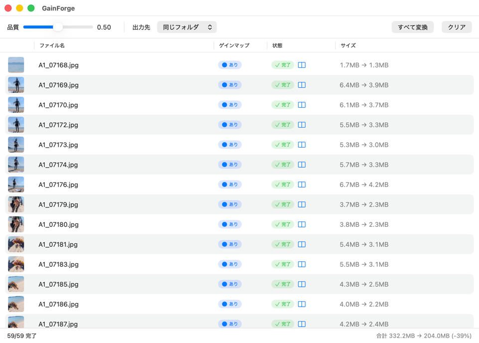
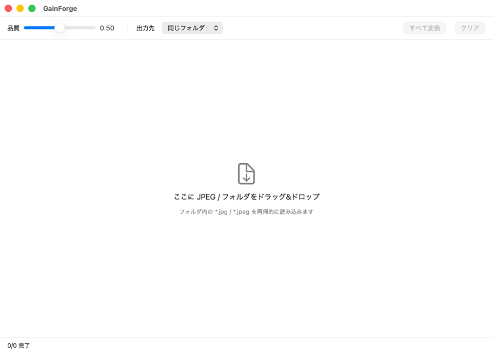
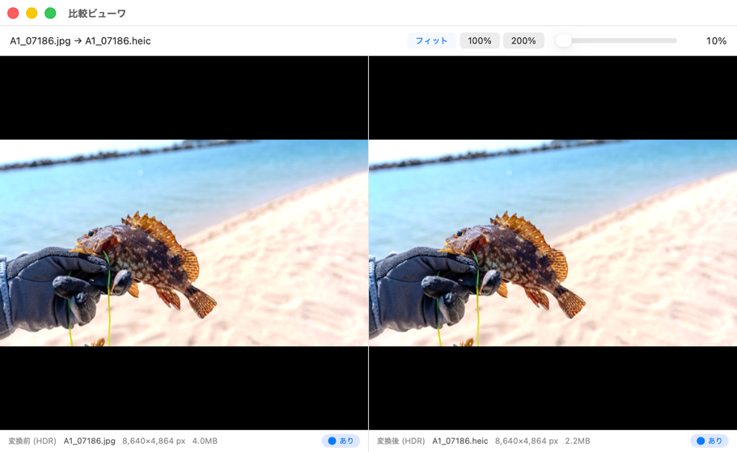

# GainForge 画面仕様（GUI / macOS）

> 本書は GUI（SwiftUI / macOS）の画面仕様を定める。機能・アーキテクチャの全体像は [仕様.md](仕様.md) を参照。
> 変換ロジックは `GainForgeCore` に一元化され、GUI はその薄いラッパとして UI と状態管理のみを担う。

## 変更履歴

- 2026-06-26: 初版。単一ウィンドウ構成、ファイル一覧テーブル、バッチ変換フローを策定。
- 2026-06-26: 比較ビューワ（別ウィンドウ、変換前後の左右表示・ズーム・同期パン）の仕様を追加。完了行の「状態」セルに起動アイコンを追加。HDR プレビューの方針を確定事項へ移動。
- 2026-06-26: 実装に合わせて全面更新。画面スクリーンショットを追加し画面モックアップ（AA）を撤去。選択行の再変換（「すべて変換」/「選択を変換」）、`既存` 状態、既存ファイルの上書き確認ダイアログ、比較ビューワのダブルクリック起動・選択追従・トラックパッド操作、ウィンドウ位置・サイズ保存などを反映。
- 2026-07-04: ツールバーに「SDR画像」ポップアップを追加（ゲインマップ無し入力を「SDRで保存」/「HDR補正（カーブ）」で変換。既定は SDR 保存。HDR 入力には影響しない）。設定の永続化・リセット対象に追加。
- 2026-07-04: 「SDR画像」に「HDR補正（ML/LUT）」を追加（Apple 学習の色→ゲイン LUT）。HDR 補正の出力は 10bit 化。ML/LUT は学習データを読めないときカーブ法へ自動降格し、起動中一度だけダイアログで通知する。
- 2026-07-08: ツールバーに「サイズ」ポップアップ＋数値フィールド（プリセット付き）を追加。書き出し時に縮小（元のサイズ / 総画素数 / 横幅 / 縦幅）を選べる。縮小のみ・アスペクト比維持で全経路に効く。設定の永続化・リセット対象に追加。

---

## 目次

- [設計方針](#設計方針)
- [画面構成](#画面構成)
- [ウィンドウ全体レイアウト](#ウィンドウ全体レイアウト)
- [各エリアの仕様](#各エリアの仕様)
  - [ツールバー](#ツールバー)
  - [ファイル一覧テーブル](#ファイル一覧テーブル)
  - [ステータスバー](#ステータスバー)
- [比較ビューワ（別ウィンドウ）](#比較ビューワ別ウィンドウ)
- [状態モデル](#状態モデル)
  - [ファイル行の状態遷移](#ファイル行の状態遷移)
  - [画面全体の状態](#画面全体の状態)
- [主要操作フロー](#主要操作フロー)
- [出力仕様](#出力仕様)
- [エラー表示](#エラー表示)
- [確定事項](#確定事項)
- [未確定事項・今後の検討](#未確定事項今後の検討)

---

## 設計方針

- **単一ウィンドウ・画面遷移なし。** ドロップ → 設定 → 変換 → 結果確認 → クリア、という一連の流れを 1 画面で完結させる。
  - 一覧・進捗・結果がすべて同じテーブル上で更新されるため、状態がひと目で分かる。
  - 設定（品質・出力先・SDR画像の扱い）は常時表示。モーダルやタブに隠さない。
- **一覧 = 作業状態。** ドロップしたファイル群がそのまま「変換キュー兼結果一覧」になる。
- **選択で部分再変換。** 一覧の行を選べばその行だけを、選ばなければ全件を変換する。完了行も品質を変えて何度でもやり直せる。
- **クリアで初期状態へ戻れる。** 変換後でも一覧を空にして、ドロップ受付の初期表示に戻せる。
- **比較ビューワは補助ウィンドウ。** 変換前後の拡大比較は別ウィンドウで行い、メインの画面遷移フローには含めない。
- **UI はプラットフォーム非依存を意識。** 将来 iOS 展開に備え、ロジックは Core に寄せ、UI 固有依存を最小化する。

## 画面構成

1 つのメインウィンドウのみ。構成要素は次の 3 エリア。

| エリア | 役割 |
|---|---|
| ツールバー（上部） | 品質スライダー、出力先設定、SDR画像の扱い、変換 / 中止、クリア |
| ファイル一覧テーブル（中央） | ドロップ受付、ファイルごとの情報・状態表示。空のときは Empty state |
| ステータスバー（下部） | 全体進捗、件数、合計サイズ・削減率 |

## ウィンドウ全体レイアウト

実際のメインウィンドウ（ファイル一覧テーブルにバッチ変換結果を表示した状態）。

### Empty state（一覧が空のとき）

一覧が空のときは、テーブル領域の中央にドロップ受付のプレースホルダ（下向き矢印アイコン＋案内文）を表示する。起動直後の画面は次のとおり。

- 表示文言：「ここに JPEG / PNG / フォルダをドラッグ&ドロップ」「フォルダ内の *.jpg / *.jpeg / *.png を再帰的に読み込みます」。
- ドロップ受付は一覧テーブル領域全体（Empty state でも、行があるときも同じ）。ドラッグ中は領域を枠線でハイライトする。

## 各エリアの仕様

### ツールバー

| コントロール | 仕様 |
|---|---|
| 品質スライダー | 範囲 `0.0`–`1.0`、既定 `0.60`。現在値を数値ラベルで併記。CLI の `-q` に対応。SDR ベース画像の圧縮率に作用し、ゲインマップは生転写のため不変。変換中は無効化 |
| 出力先トグル | 「同じフォルダ」/「指定フォルダ」を切替。既定は「同じフォルダ」。変換中は無効化 |
| フォルダ選択ボタン | 出力先が「指定フォルダ」のときのみ表示・有効。選択中フォルダ名を近傍に表示（未選択時は「未選択」）。CLI の `-o` に対応 |
| SDR画像ポップアップ | ゲインマップ無し（SDR）入力の変換方法：「SDRで保存」（既定・従来挙動、8bit）/「HDR補正（カーブ）」（手書きの明部加重カーブ）/「HDR補正（ML/LUT）」（Apple 写真の実 HDR から学習した色ごとのゲイン LUT）。HDR補正はいずれも明部だけを HDR ヘッドルームへ拡張しベースの見た目は維持、出力は 10bit。ゲインマップ付き（HDR）入力には影響しない。CLI の `-x` / `--hdr`（カーブ）・`-m` / `--hdr-ml`（ML/LUT）に対応。ML/LUT は学習データを読めない場合カーブ法へ自動降格し、起動中一度だけダイアログで通知する。変換中は無効化 |
| サイズポップアップ＋数値フィールド | 書き出し時の縮小方式：「元のサイズ」（既定・リサイズなし）/「総画素数」（Mpix）/「横幅」（px）/「縦幅」（px）。方式以外を選ぶと数値フィールド（プリセット⌄付き・自由入力可）が現れる。縮小のみ・アスペクト比維持で、原寸超え指定は原寸のまま。全経路（生転写 HDR / SDR / 合成）に効き、生転写ではゲインマップも同率で縮小。CLI の `--mpix` / `-w` / `--height` に対応。変換中は無効化 |
| 変換ボタン | ラベルは状況で 3 通り：選択がなければ `すべて変換`、再変換できる行を選択中なら `選択を変換 (件数)`、変換中は `中止`。⌘Return でも実行。変換対象が 1 件以上、または変換中のとき有効 |
| クリアボタン | 一覧を空にし Empty state に戻す。変換中は無効化 |

- 品質・出力先・指定フォルダ・SDR画像の扱い・リサイズの設定は次回起動時に復元する（`UserDefaults`）。
- アプリメニュー（About の直後）に「設定をリセット」を用意。品質・出力先・指定フォルダ・SDR画像の扱い・リサイズを既定値へ戻す（一覧やウィンドウ位置・サイズには触れない）。変換中は無効。

#### 変換対象（選択 / 全件）の決め方

- 一覧で行を選択していると、その選択行のうち「変換中以外」を変換対象にする。完了・既存・エラー・スキップ・待機を問わず、品質を変えて何度でも再変換できる。ボタンは `選択を変換 (件数)`。
- 選択がなければ、待機・完了・エラー・スキップの全行を対象にする（完了行も毎回やり直す）。ただし「既存」（変換前から在った HEIC）は自分が作ったとは限らないため既定では外す。ボタンは `すべて変換`。
- Esc で選択を解除すると、対象は「全件」へ戻る。
- バッチ開始時点の対象をスナップショットする。変換中に追加された行はこのバッチに含めず、次回の変換で処理する。

### ファイル一覧テーブル

各行が 1 つの入力ファイルを表す。列は以下。

| 列 | 内容 |
|---|---|
| サムネイル | 入力 JPEG の縮小プレビュー（取得前はプレースホルダ）。列ヘッダは無し |
| ファイル名 | ファイル名（中央省略表示、ホバー / ツールチップでフルパス） |
| ゲインマップ | Chip 表示。`あり`（● 塗り円・アクセント色）/ `なし`（○ 円・グレー）/ 判定中は `判定中…`。`GainForgeCore.hasGainMap` の判定結果（非同期取得） |
| 状態 | Chip 表示。`待機` / `変換中`（時計）/ `完了`（チェック・緑）/ `既存`（シール付きチェック・ティール）/ `エラー`（三角・赤）/ `スキップ`。エラー時は Chip の右に ⓘ アイコンを併設しツールチップに理由を表示。**出力 HEIC を持つ行（完了 / 既存）** は Chip の右に左右分割アイコン（`rectangle.split.2x1`）を併設し、押下で[比較ビューワ](#比較ビューワ別ウィンドウ)を開く |
| サイズ | `変換前 → 変換後`。変換前は読み込み時に確定、変換後は完了時に確定（`-` / `…` で未確定を表現） |

- ドロップは一覧テーブル領域全体で受け付ける（行があってもエリア全体が D&D 対象）。ドラッグ中は枠線でハイライト。
- 追加時、すでに一覧にある同一パスのファイルは重複追加しない（同バッチ内の重複も排除）。
- 行をダブルクリック / Return で、その行の[比較ビューワ](#比較ビューワ別ウィンドウ)を開く（単一行のとき）。
- 行の個別操作：右クリックメニュー / Delete キーで「一覧から削除」（変換中は無効）/「Finder で表示」。出力 HEIC を持つ行は「出力 HEIC を Finder で表示」、単一選択なら「比較ビューワで表示」を追加。
- サムネ・サイズ・ゲインマップ有無・既存 HEIC 検出は読み込み時に非同期で行う（同時数を抑制）。判定中はプレースホルダ（例：`判定中…`）を表示する。

### ステータスバー

- 進捗：`完了数 / 総数 完了`（変換中はスピナー併記）。完了数は 完了 / エラー / スキップ の合計。
- エラー / スキップ：いずれかがあれば件数を表示（例：`エラー 1 / スキップ 0`。エラーがあれば赤）。
- 集計：完了分の `合計変換前サイズ → 合計変換後サイズ (削減率%)`。減れば `-NN%`、増えれば `+NN%`、同じなら `±0%`。

## 比較ビューワ（別ウィンドウ）

変換後の結果を、**変換前（入力 JPEG）と変換後（出力 HEIC）を左右に並べて**拡大比較するための専用ビューワ。メインの「単一ウィンドウ・画面遷移なし」方針はファイル処理フローに対するものとし、比較ビューワは**それとは独立した補助ウィンドウ**として扱う（フローの画面遷移には含めない）。

### 位置づけ・起動

- 出力 HEIC を持つ行（`完了` または `既存`）の「状態」セルにある左右分割アイコン、または行のダブルクリック / Return で開く。
- **ビューワは常に 1 つだけ**（シングルインスタンス）。
  - すでに開いている状態で別の行のアイコンを押すと、**新しいウィンドウは作らず**、既存ビューワの表示内容を押された行の画像に**差し替える**。
  - 既に開いているビューワが背面にある場合は最前面へ移動し、内容を差し替える。
  - **ビューワが開いている間は、一覧で別の 1 行を選択すると表示が追従して切り替わる**（単一選択時のみ）。
- 対象行を削除、または一覧をクリアした場合、その行を表示中のビューワは閉じる（空表示にする）。
- 起動時に自動表示はしない（状態復元による再表示も抑止）。

### レイアウト

左右 2 ペイン（`HSplitView`）。左＝変換前（入力 JPEG / SDR）、右＝変換後（出力 HEIC）。上部にファイル名とズーム操作を表示する。

- 出力 HEIC を持つ行：左＝変換前（入力 JPEG）、右＝変換後（出力 HEIC。既存検出時はラベルが「既存 HEIC」）。
- 出力を持たない行をダブルクリックした場合：**「元画像のみ」の 1 ペイン**を表示する（右半分は黒で埋め、50/50 のデバイダ位置を保つ）。
- 上部バーにファイル名（`入力 → 出力`）とズーム操作を表示。
- 各ペイン下部のキャプションに、ラベル（変換前 / 変換後 / 既存 HEIC / 元画像）・ファイル名・ピクセル寸法・ファイルサイズ・ゲインマップ有無チップを表示する。
- 2 ペインは**同じ表示倍率・同じスクロール位置**を共有する。

### ズーム

倍率は**両ペイン同時に**変更する。プリセット（ボタン）と任意倍率スライダーの 2 系統を用意し、両者は同じ倍率値を双方向に共有する。

**プリセット（ボタン）**

| モード | 挙動 |
|---|---|
| フィット（アスペクトフィット） | ペインに収まるよう全体を表示。既定。画像全体が見えるためパン不要 |
| 100% | 等倍（1 画像ピクセル = 1 表示ポイント）。劣化・ディテールの等倍比較に使う |
| 200% | 2 倍拡大。圧縮ノイズやエッジの精査に使う |

**任意倍率スライダー**

- 範囲は **10%〜800%**、**対数スケール**（100% を中心に拡大・縮小が対称な操作感になる）。現在値を数値ラベルで併記。
- 下限 10%：大きな画像を俯瞰（フィットより引いた表示も可能）。
- 上限 800%：JPEG の 8×8 DCT ブロックが視認でき、圧縮劣化（`-q` の効果）を画素レベルで精査できる。
- プリセットとスライダーは同じ倍率値を共有し、互いに追従する。「フィット」は実効倍率（ウィンドウ・画像サイズから算出）でスライダー位置に反映し、手動でスライダーを動かした時点でフィット選択は解除される。
- トラックパッドのピンチではカーソル位置を基準にズームする（ペインより画像が大きい場合はパンで位置を移動）。

### パン（ドラッグ移動）と同期

- ペイン内をマウスでドラッグ、またはトラックパッドの二本指スクロールで表示位置を移動できる。トラックパッドのピンチで拡大・縮小する。
- **一方を動かすと、もう一方も同じ量だけ追従して動く**（左右が常に同じ箇所を映す）。同期は**画像ピクセル座標**（倍率・中心位置の共有）を基準とする。
- アスペクトフィット時は全体が収まりパンは不要のため、ドラッグ / スクロールは無効。

### HDR 描画（変換前後の比較）

比較の主目的は **(a) ゲインマップによる HDR 表示効果の確認** と **(b) SDR ベースでの圧縮劣化の確認** の両方。

- 右ペイン（変換後 HEIC）は常に **HDR（EDR）描画**を要求し、ディスプレイが対応していればゲインマップが効いた明部の伸びを確認できる。
- 左ペイン（変換前）は、**入力 JPEG 自体がゲインマップを持つ場合は HDR**、持たない場合は SDR で描画する（ラベルも「変換前 (HDR)」/「変換前 (SDR)」と切り替わる）。
- HDR 非対応ディスプレイでは、システムのトーンマッピングに従って SDR 表示にフォールバックする。
- 等倍（100% / 200%）比較により、SDR ベースの圧縮劣化（`-q` の効果）も画素レベルで確認できる。

> 注: 旧「未確定事項」の「HDR プレビュー（変換前後の比較表示）の要否と方式」は本ビューワ仕様で確定とする。

## 状態モデル

### ファイル行の状態遷移

- 追加直後は **待機**。読み込み時に、入力と同名の `.heic` が出力先（同じフォルダ / 指定フォルダ）に既にあれば **既存** とし、変換せずに比較プレビューできるようにする。
- 変換を開始すると **待機 → 変換中 →**（結果に応じて）**完了 / エラー / スキップ**（スキップは出力衝突などで変換しない場合）。
- **完了 / 既存 / エラー / スキップ** の行も、選択して再変換すれば再び **変換中** に戻せる（品質を変えてやり直す等）。
- ゲインマップ無しの JPEG も **常に変換する**（CLI の `-f` を常時有効にした挙動に相当）。変換方法は「SDR画像」ポップアップに従い、`SDRで保存`（SDR HEIC 化・8bit）か `HDR補正（カーブ）` / `HDR補正（ML/LUT）`（ゲインマップを合成した 10bit HDR HEIC 化）を選べる。ゲインマップ有無で待機可否は変えない。
- 「クリア」は全行を破棄して初期状態（Empty state）へ戻す。

### 画面全体の状態

| 状態 | 説明 | 変換ボタン | クリアボタン | 設定変更 |
|---|---|---|---|---|
| 空 | 一覧なし。Empty state 表示 | 無効 | 無効 | 可 |
| 待機 | 待機行あり、未変換 | 有効（「すべて変換」/「選択を変換」） | 有効 | 可 |
| 変換中 | バッチ実行中 | 有効（「中止」） | 無効 | 不可 |
| 完了 | 待機行なし（完了 / 既存 / エラー / スキップ） | 変換対象があれば有効（「すべて変換」＝再変換 / 「選択を変換」）。対象が「既存」だけなら無効 | 有効 | 可 |

- 変換中に新規ドロップされたファイルは「待機」として一覧に追加し、現在のバッチには含めない（次回変換で処理）。

## 主要操作フロー

1. **ドロップ**：JPEG / PNG / フォルダをドロップ。フォルダは再帰的に `*.jpg` / `*.jpeg` / `*.png` を収集。各行を「待機」で追加し、サムネ・サイズ・ゲインマップ有無・既存 HEIC を非同期取得（既存があれば「既存」になる）。
2. **設定**：必要に応じて品質スライダーと出力先を調整。
3. **変換**：変換ボタン押下。選択があれば選択行、なければ全件を順に処理し、行状態とステータスバーをリアルタイム更新。出力先に既存ファイルがあれば開始前に上書き確認ダイアログを出す。
4. **結果確認**：各行の状態 Chip とサイズ、ステータスバーの集計で結果を把握。エラー行は ⓘ ツールチップで原因確認。完了 / 既存行の起動アイコン、または行のダブルクリックから[比較ビューワ](#比較ビューワ別ウィンドウ)を開き、変換前後を左右で拡大比較する（ビューワは 1 つを使い回し、別行を開く / 選択すると内容が差し替わる）。
5. **クリア / 追加変換**：クリアで初期化、または追加ドロップして再度変換。

- **中止**：変換中に「中止」を押すと、新規投入を止める。実行中（最大 3 件、コア数依存）は完走させ、未投入の行は「待機」のまま残す。

## 出力仕様

- **出力先**：
  - 「同じフォルダ」：入力 JPEG と同じディレクトリに `<元名>.heic` を生成。
  - 「指定フォルダ」：選択フォルダ直下に `<元名>.heic` を生成。
- **バッチ内の出力衝突**：同名 `.heic` になる行は**必ず連番（`_1`, `_2` …）でずらす**。並列変換時の取り違え・相互上書きを設計段階で排除する。
  - 例：同名が重なる場合 `DSC001.heic` / `DSC001_1.heic` / `DSC001_2.heic` …
- **ディスク上の既存ファイル**：出力先に同名 `.heic` が既存の場合、変換開始前に**上書き確認ダイアログ**を出す（「上書き」既存を置き換え／「別名で保存」既存を残し連番で保存／「キャンセル」）。
- **処理中の予期せぬ既存ファイル**：計画になかった同名ファイルが処理中に出力先へ現れた場合は、安全のため残りの変換を中断し、その旨を通知する。
- **検算**：書き出し後、ゲインマップ有り入力については `hasGainMap` で埋め込みを検算する（[仕様.md](仕様.md) の落とし穴 6 に準拠）。検算失敗時はエラー扱い。

## エラー表示

- 行単位でエラーを表現（状態 Chip `エラー` ＋ Chip 右の ⓘ アイコンのツールチップに `GainForgeError` のメッセージ）。
- バッチ全体は止めず、エラー行をスキップして次へ進む（1 件のエラーで全体を中断しない）。ただし計画外の既存ファイルへの衝突など安全に関わる場合は中断する。
- ステータスバーにエラー件数を集計表示。

## 確定事項

- 単一ウィンドウ・画面遷移なし。
- ファイル一覧テーブル中心の UI（ドロップ受付・進捗・結果を兼ねる）。
- 選択行の再変換（「選択を変換」）／選択なしは全件（「すべて変換」）。Esc で選択解除して全件へ戻る。
- 出力先は「同じフォルダ / 指定フォルダ」のトグル切替。
- バッチ内の出力衝突は連番付与で回避。ディスク上の既存ファイルは上書き確認ダイアログ（上書き / 別名で保存 / キャンセル）で解決。
- ゲインマップ無しの JPEG も常に変換。「SDR画像」ポップアップで `SDRで保存` / `HDR補正（カーブ）` を選択（既定は SDR 保存）。
- 読み込み時に既存 HEIC を検出し「既存」として比較プレビュー可能にする。
- クリアで初期状態に戻れる。
- 変換前後の比較は専用の[比較ビューワ](#比較ビューワ別ウィンドウ)（別ウィンドウ）で行う。シングルインスタンス、左右同期パン、変換後ペインの HDR 描画。未変換行は元画像 1 ペイン。ズームはプリセット（フィット / 100% / 200%）＋任意倍率スライダー（10%〜800%、対数スケール、両者連動）。マウス・トラックパッド（ドラッグ / 二本指スクロール / ピンチ）に対応。
- 比較ビューワの起動アイコンは完了 / 既存行の「状態」セルに表示。行のダブルクリック / Return でも開く。開いている間は一覧の行選択に追従する。
- 並列変換（スライディングウィンドウ、同時上限 3 / コア数依存）。中止は実行中を完走し未投入行は待機に残す。
- メイン / 比較ビューワのウィンドウ位置・サイズを保存・復元する。

## 未確定事項・今後の検討

- [x] 「SDR画像」に **HDR補正（ML/LUT）** を追加済み（Apple 学習の色→ゲイン統計 LUT。カーブ法と選択制、LUT 不可時はカーブへ降格し通知）。今後、ExpandNet 等の CoreML モデル化や強度スライダーの要否を引き続き検討。
- [ ] 変換後ファイルサイズの事前推定表示（変換前に削減見込みを出すか）。
- [ ] ゲインマップ縮小（`gainScale`）を UI から指定可能にするか（[仕様.md](仕様.md) の任意機能）。
- [ ] テーブル列幅の保存（現状ウィンドウフレームは保存するが、列幅は未保存）。
- [ ] ダークモード時の Chip 配色。
